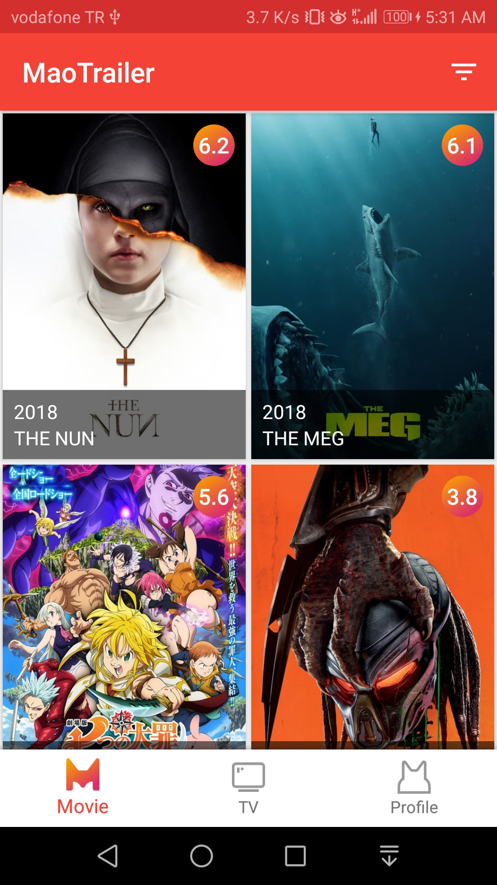
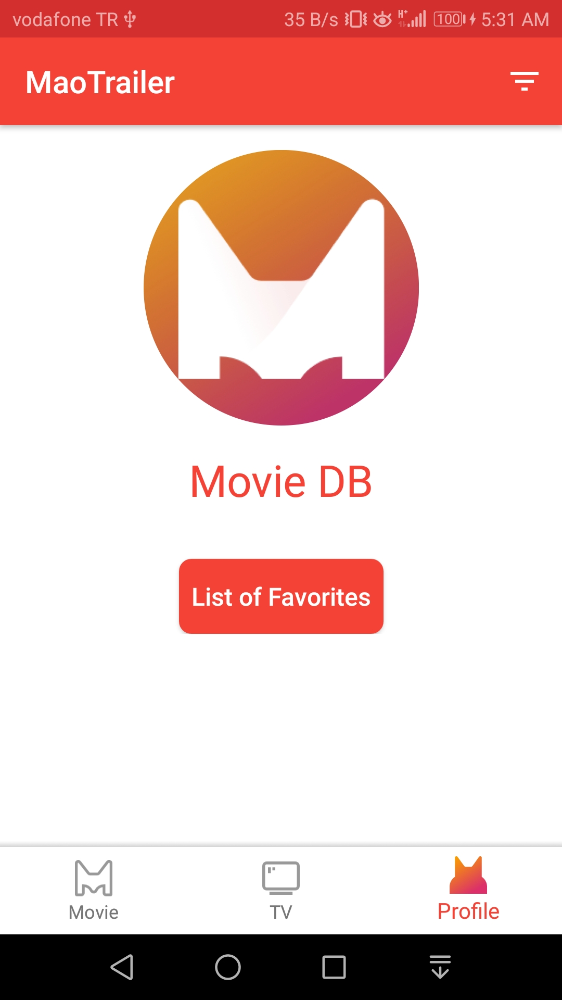
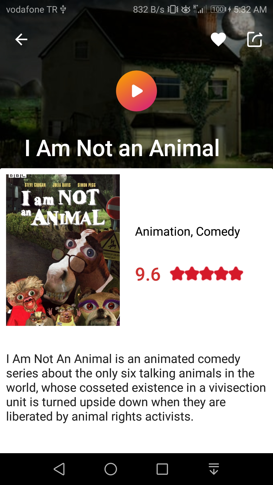
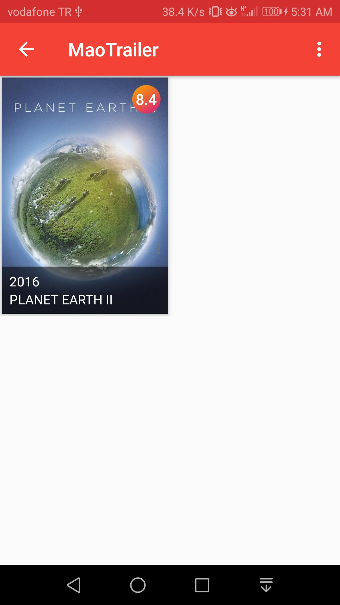

# MaoTrailer

<p align="center"></p>


**MaoTrailer** is a movies/tv series tracking app that uses [The Movie Database](https://api.themoviedb.org) in the backend. Users can view thousands of collection in the app and add them to their favorite lists.

Please visit [The Movie Database](https://api.themoviedb.org) to obtain your own API Key.

**This project uses SOLID Principle and Clean Code approaches behind of its own**

### Configuration

In order to run this project, you need to get your own **API Key** from [The Movie Database](https://api.themoviedb.org)

Then set your API Key in the `gradle.properties` file as follows:

    API_KEY = "your-api-key"

### Features

- [x] Users can view thousands of collection.
- [x] Users can add any movie/tv series to their favorites list.
- [x] Users can remove movie/tv series from the favorites list.
- [x] Users can watch relative videos over the app.

### Screenshots

#### Phone

Movie Screen            |  TV Series Screen |  Profile Screen | Detail Screen  | Favorites Labeling
:-------------------------:|:-------------------------:|:-------------------------:|:-------------------------:|:-------------------------:
  |   |   |    |  


### Credits

* [Support Library](https://developer.android.com/topic/libraries/support-library/)
* [MVVM Pattern](https://github.com/googlesamples/android-architecture)
* [Architecture Components](https://developer.android.com/topic/libraries/architecture/)
* [BindingAdapter](https://developer.android.com/reference/android/databinding/BindingAdapter.html)
* [ConstraintLayout](https://developer.android.com/training/constraint-layout/)
* [Dagger2](https://github.com/google/dagger)
* [Retrofit2](https://github.com/square/retrofit)
* [RxJava2](https://github.com/ReactiveX/RxJava)
* [Glide](https://github.com/bumptech/glide)
* [GlideModule](http://bumptech.github.io/glide/doc/generatedapi.html#availability)
* [Timber](https://github.com/JakeWharton/timber)
* [OkHttp](https://github.com/square/okhttp)
* [DataBinding](https://developer.android.com/topic/libraries/data-binding/index.html)
* [Room Persistence Library](https://github.com/googlecodelabs/android-room-with-a-view)
* [Paging Library](https://developer.android.com/topic/libraries/architecture/paging/)


### License

```
MIT License

Copyright (c) 2018 Nuh Koca

Permission is hereby granted, free of charge, to any person obtaining a copy
of this software and associated documentation files (the "Software"), to deal
in the Software without restriction, including without limitation the rights
to use, copy, modify, merge, publish, distribute, sublicense, and/or sell
copies of the Software, and to permit persons to whom the Software is
furnished to do so, subject to the following conditions:

The above copyright notice and this permission notice shall be included in all
copies or substantial portions of the Software.

THE SOFTWARE IS PROVIDED "AS IS", WITHOUT WARRANTY OF ANY KIND, EXPRESS OR
IMPLIED, INCLUDING BUT NOT LIMITED TO THE WARRANTIES OF MERCHANTABILITY,
FITNESS FOR A PARTICULAR PURPOSE AND NONINFRINGEMENT. IN NO EVENT SHALL THE
AUTHORS OR COPYRIGHT HOLDERS BE LIABLE FOR ANY CLAIM, DAMAGES OR OTHER
LIABILITY, WHETHER IN AN ACTION OF CONTRACT, TORT OR OTHERWISE, ARISING FROM,
OUT OF OR IN CONNECTION WITH THE SOFTWARE OR THE USE OR OTHER DEALINGS IN THE
SOFTWARE.
```
